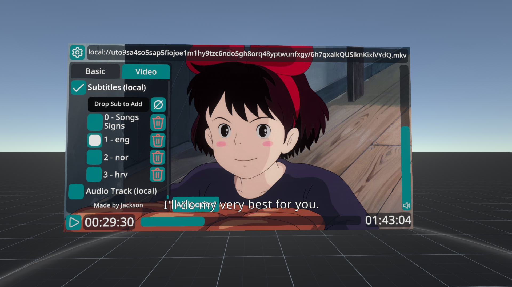

Resonite Subtitle Importer
===========

A [ResoniteModLoader](https://github.com/resonite-modding-group/ResoniteModLoader) mod for [Resonite](https://resonite.com/) that allows you to automatically extract and import subtitles from any non streamed video you spawn/import or also on players that you change the URL of.

Subtitles will be imported into a slot called `Subtitles - [filename]` with the tag `SubtitleImport`. This slot will either be parented to the video player or in the LocalUserSpace if enabled on manual imports. The slot will be parented to the player after all subs have been imported. Each subtitle track will get its own slot named `#-name` where # is the number and name the subtitle track name. Each imported subtitle track gets its own animator and dynamic variables for easy access.

The dynamic variable space on each subtitle is called `Subtitle` and contains a few variables:
 * `Subtitle/Uri` Type `Uri`: The URI of the subtitle asset
 * `Subtitle/Text` Type `String`: The subtitle text of the current playback position
 * `Subtitle/Animation` Type `IAssetProvider<Animation>`: The Animation asset of the subtitle

## Installation
1. Install [ResoniteModLoader](https://github.com/resonite-modding-group/ResoniteModLoader).
2. Place the `rml_mods` and `rml_libs` folders in your Resonite installation directory. Your installation should be at `C:\Program Files (x86)\Steam\steamapps\common\Resonite` for a default install. You can create it if it's missing, or if you launch the game once with ResoniteModLoader installed it will create the folder for you.
3.  Install **ffmpeg** by opening a command prompt as admin and execute `winget install ffmpeg` if you have winget. To get and admin command prompt right click your windows icon in the task bar and start the admin cmd. Otherwise manually install ffmpeg from [here](https://www.gyan.dev/ffmpeg/builds/#release-builds) and add the bin folder to your `PATH` environment variable or copy the exe files in the bin directory directly to your Resonite installation (same folder as Resonite.exe).
3. Start the game. If you want to verify that the mod is working you can check your Resonite logs.

## Usage

The mod is enabled by default and any video that you import or spawn that is not set to streaming in the VideoTextureProvider should import its subtitles. To check import a video with subtitle and open an inspector on the video. There should be a slot named `Subtitles - [filename]` in their with the subs. If not the mod may not be able to find ffmpeg or fail in another way.

You can also check if you get the `Import Subtitles` button on the `VideoTextureProvider` ond the video assets slot of the video player and click that for a manual import. If that button is missing the mod was not loaded.

### Video Player

I also adapted my video player to support the imported subtitles. It can be found in this public folder `resrec:///U-Jackson/R-bb8dee84-51c3-4184-b8ef-38266b1874d9` (Copy and paste the link into Resonite). Subtitles can be enabled in the Video settings tab. Enabling them and changing language is local. Additional subtitles can be added by dragging the slot and dropping it into the drop zone. Changing the URL also imports the subs automatically after they are loaded. Make sure streaming is **disabled**.

## Known Problems

### `` tags in SRT files

We noticed that Resonite cannot handle most of the `` tags in SRT files so we completely remove those after conversion they would show up in the sub text. If you still see some weird tags in the output, or generally some weird conversion artifacts, please make a bugreport on the discord (or better create an GitHub issue) and attach some screenshot of the broken parts.

### Help my subtitles were not imported!

Sadly we can only export/import text based subtitles. A lot of videos contain subs in a bitmap format which we cannot use, so these will be skipped. You can check your logs for `Subtitle extraction failed!` messages from the mod. This should also include the ffmpeg error.

Sometimes the subs cannot be converted for one reason or another, but nothing we can really do about as that's a file/ffmpeg error.